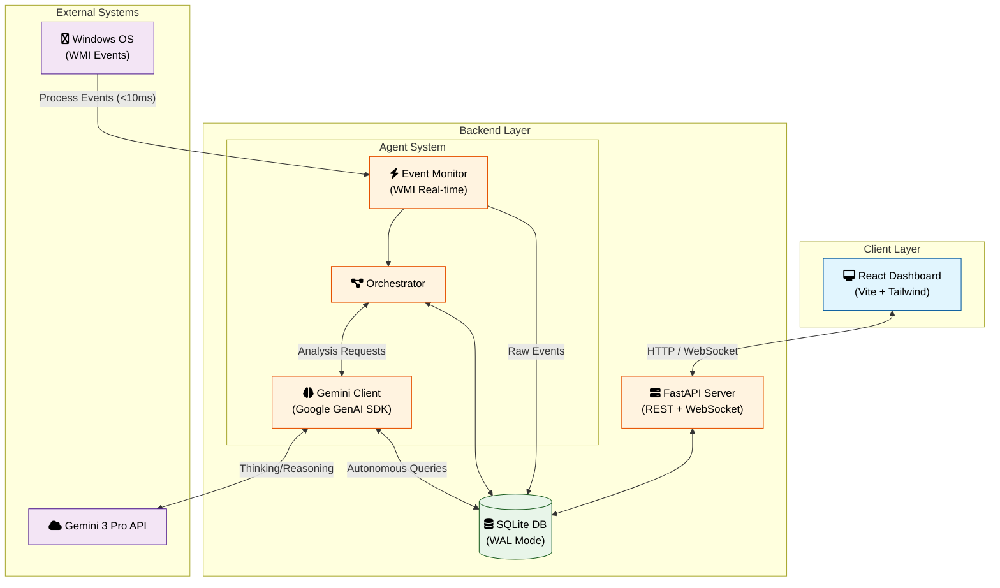
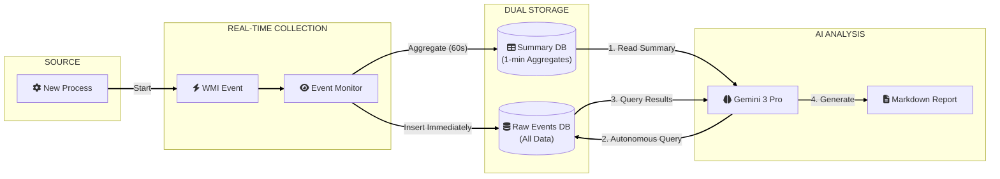
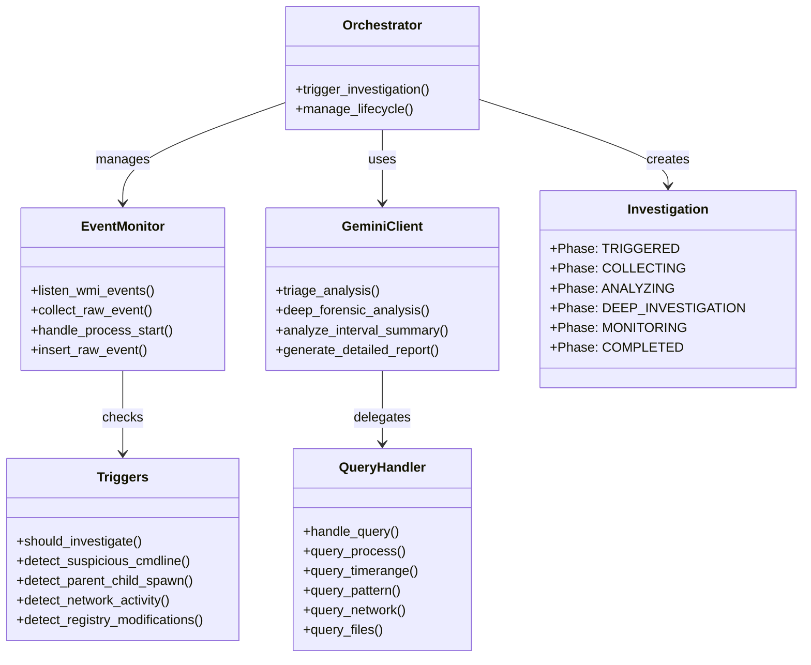
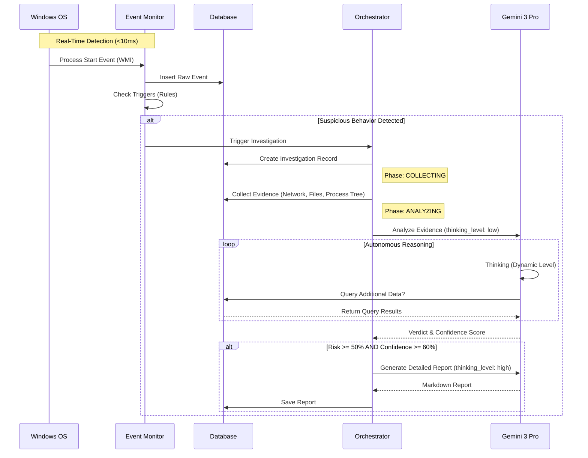

# PROCSee

AI-Powered Security Monitoring with Gemini 3 Pro

PROCSee is an autonomous security investigation system that uses Google's Gemini 3 Pro to intelligently detect, investigate, and analyze suspicious processes in real-time. Built for the Gemini 3 Hackathon, it demonstrates advanced AI-driven security operations with self-directed querying and multi-turn reasoning capabilities.

---

## Core Innovation: Dual-Database Architecture with Real-Time Monitoring

PROCSee implements a revolutionary dual-database architecture that achieves 100% detection of malicious processes, including those that execute and terminate in less than 1 second.

### Architecture Overview

**Real-Time Event Collection (Raw Events Database)**
- WMI event-based monitoring captures ALL process creations with less than 10ms latency
- Complete process activity data collected immediately: network connections, file access, CPU usage, memory consumption, registry modifications, scheduled tasks
- Data stored in `raw_process_events` table with size-based retention (configurable, default 1GB database limit)
- Available for Gemini's autonomous querying system

**Intelligent Summarization (Summary Database)**
- Every 60 seconds, raw events are aggregated into 1-minute summaries
- Summaries include: total processes, suspicious patterns, high CPU/network activity, registry modifications, scheduled tasks
- Per-process activity tracking with detailed behavior analysis
- Summaries sent to Gemini 3 Pro for autonomous analysis
- Persistent storage in `summary_intervals` table

**Why This Matters**
Traditional security tools poll every 2-10 seconds and miss fast-executing malware. PROCSee's WMI event-based monitoring captures every single process the moment it starts. The dual-database design keeps Gemini's context focused on relevant patterns while maintaining complete forensic data for deep investigation.

---

## System Architecture

### 1. System Overview
This high-level diagram shows how PROCSee's components interact with the key external systems (OS and Gemini 3 Pro).



### 2. Real-Time Data Flow Pipeline
This diagram illustrates the "Dual-Database" architecture and how data flows from the OS to the AI in real-time.



### 3. Agent Component Structure
A detailed look at the internal components of the Python Agent (`agent/` directory).



### 4. Autonomous Investigation Sequence
How PROCSee handles a suspicious event from detection to verdict.



---

## Key Features

### 1. Real-Time Event-Based Monitoring

**100% Detection Rate**
- WMI event callbacks fire when ANY process starts (less than 10ms latency)
- Captures processes even if they terminate in less than 1 second
- No polling overhead or missed detections
- Graceful fallback to polling-based monitoring if WMI unavailable

**Comprehensive Data Collection**
- Process metadata: PID, name, path, parent, command line, user
- Resource usage: CPU percent, memory consumption, thread count
- Network activity: Active connections, listening ports, remote IPs
- File operations: Open files, working directory
- System modifications: Registry changes, scheduled task creation
- Execution context: Parent-child relationships, spawn chains
- Interval grouping: Events tagged with minute-level interval_id (YYYY-MM-DD_HH:MM) for efficient aggregation

### 2. Gemini 3 Pro Autonomous Investigation

**Self-Directed Querying**
Gemini doesn't just analyze data—it decides what additional information it needs and queries for it autonomously:

- `QUERY_PROCESS`: Detailed information about specific process
  - Gemini specifies: `process_id`, `time_range`, `details` (network, file_access, cpu, metadata, or all)
  - Returns all available data even if less than requested time range
  - Handles short-lived processes gracefully (returns investigation data if process terminated)
  - Provides actual data coverage with timestamps

- `QUERY_TIMERANGE`: All events within specified time windows
  - Available time ranges: `last_1_minute`, `last_5_minutes`, `last_10_minutes`, `last_30_minutes`, `last_hour`
  - Default: `last_5_minutes` if not specified
  - Optional event type filtering
  - Returns up to 500 events, limited to first 50 in response

- `QUERY_PATTERN`: Behavior pattern matching
  - Patterns: `shell_spawn` (PowerShell, cmd.exe, bash, sh), `high_network` (many connections), `suspicious_path` (temp, appdata locations)
  - Gemini specifies pattern and time range
  - Returns up to 100 matches, limited to first 20 in response

- `QUERY_NETWORK`: Network activity analysis
  - Filters by minimum connection count
  - Returns processes with network activity in specified time range
  - Includes connection details (local/remote addresses, status)
  - Up to 200 events analyzed, top 30 returned

- `QUERY_FILES`: File access pattern analysis
  - Optional file pattern matching (e.g., ".exe", ".dll")
  - Returns processes accessing files matching pattern
  - Includes list of accessed files
  - Up to 200 events analyzed, top 30 returned

**Multi-Turn Reasoning**
- Initial analysis of 1-minute summary
- Autonomous query execution based on findings
- Re-analysis with query results
- Iterative investigation until confident verdict reached
- Complete audit trail of all queries in `gemini_queries` table

**Dynamic Thinking Levels**
- `thinking_level="low"`: Fast triage for interval summaries and initial assessments (speed optimized)
- `thinking_level="high"`: Deep forensic analysis and report generation (reasoning optimized)
- `include_thoughts=True`: Exposes Gemini's reasoning process for transparency

**1M Token Context Window**
- Entire investigation history maintained in context
- All evidence items (process tree, network connections, file access)
- Previous query results and findings
- Historical summaries for pattern recognition

**Confidence Tracking**
- Explicit confidence scores (0.0-1.0) for all assessments
- Uncertainty tracking: Gemini explicitly states what it doesn't know
- Confidence-based report generation (reports generated when risk >= 50% and confidence >= 60%)

### 3. Parallel Investigation Mechanisms

**Path 1: Active Investigation (Behavior-Triggered)**
When a process exhibits suspicious behavior, immediate investigation is triggered:

1. Process starts, WMI event fires (less than 10ms)
2. Event monitor captures complete process data
3. Trigger engine evaluates behavior against detection rules
4. If suspicious, investigation orchestrator begins evidence collection
5. Investigation phases: TRIGGERED → COLLECTING → ANALYZING → DEEP_INVESTIGATION → MONITORING → COMPLETED
6. Gemini performs triage analysis (thinking_level="low")
7. If risk score exceeds 60%, deep forensic analysis (thinking_level="high")
8. Detailed Markdown report generated by Gemini for high-risk cases

**Path 2: Autonomous Monitoring (Interval-Based)**
Continuous system-wide analysis every 60 seconds:

1. Interval collector aggregates all raw events from past minute
2. Identifies patterns: suspicious behaviors, high CPU/network, registry modifications, scheduled tasks
3. Creates comprehensive summary with per-process activity tracking
4. Gemini analyzes summary (thinking_level="low")
5. If Gemini needs more data, executes autonomous queries against raw database
6. Re-analyzes with query results (thinking_level="high")
7. If threats identified, triggers active investigations
8. Detailed Markdown report generated for high-risk intervals

**Key Insight**: Active investigations respond to individual suspicious processes in real-time, while autonomous monitoring detects system-wide patterns that might not trigger individual alerts but collectively indicate compromise.

### 4. Behavior-Based Detection Engine

System-wide monitoring focused on what processes do, not where they're located:

**Command Line Analysis (40+ MITRE ATT&CK Patterns)**
- Encoded PowerShell commands (-enc, -encodedcommand)
- Execution policy bypass (-ep bypass, -executionpolicy bypass)
- Hidden windows (-windowstyle hidden)
- Download/execution patterns (Invoke-Expression, DownloadString, WebClient)
- Credential access (Mimikatz, LSASS dumps, sekurlsa)
- Persistence mechanisms (registry run keys, scheduled tasks, services)
- Defense evasion (Disable Windows Defender, exclusions)
- Lateral movement (Invoke-Command, Enter-PSSession, admin shares)
- Discovery (AD enumeration, user/group queries)
- LOLBins abuse (certutil, regsvr32, mshta, rundll32, wmic)

**Parent-Child Relationship Detection**
- Browser spawning shells (chrome.exe → powershell.exe)
- Office applications spawning scripts (winword.exe → cmd.exe)
- PDF readers executing code (acrord32.exe → wscript.exe)
- Suspicious spawn chains tracked across multiple generations

**Network Activity Monitoring**
- High connection counts (configurable threshold)
- External IP connections (non-private addresses)
- Multiple remote destinations
- Listening ports from untrusted locations

**System Modification Detection**
- Registry modifications (reg.exe, regedit.exe, reg add commands)
- Scheduled task creation (schtasks.exe, Register-ScheduledTask)
- Service manipulation (New-Service, Set-Service)
- Persistence mechanism installation

**Suspicious Process Characteristics**
- LOLBins execution (mshta.exe, regsvr32.exe, rundll32.exe, wmic.exe, certutil.exe)
- High thread counts (greater than 50 threads)
- Excessive memory usage (greater than 500MB)
- Unusual file extensions (.tmp, .dat, .bin, .txt as executables)
- Execution from suspicious directories (temp, downloads, appdata)

**Suspicion Scoring System**
- Cumulative scoring based on multiple indicators
- Investigation triggered when score >= 2 or multiple weak indicators present
- Weighted scoring: command line patterns (3 points), parent-child relationships (2 points), LOLBins (2 points)

### 5. Marathon Agent Capability

**State Persistence**
- SQLite database with WAL (Write-Ahead Logging) mode for crash recovery
- All investigation state persisted: current phase, collected evidence, analysis results
- Investigation snapshots created at each phase transition
- Automatic database checkpointing every 1000 pages

**Automatic Resume**
- Incomplete investigations automatically resumed after agent restart
- Resume from last completed phase
- No data loss on unexpected shutdown
- Investigation continuity maintained across restarts

**Investigation Phases**
1. TRIGGERED: Initial detection and investigation creation
2. COLLECTING: Evidence collection (process tree, network, files)
3. ANALYZING: Gemini triage analysis with risk scoring
4. DEEP_INVESTIGATION: Comprehensive forensic analysis (conditional, if risk > 60%)
5. MONITORING: Continued observation of process behavior
6. COMPLETED: Final verdict with complete evidence chain

**State Checkpointing**
- Snapshots stored in `investigation_snapshots` table
- Phase-specific state data preserved
- Enables investigation replay and audit
- Supports forensic timeline reconstruction

### 6. Storage Management

**Size-Based Retention**
- Configurable database size limit (default: 1GB)
- Automatic cleanup when approaching threshold (default: 900MB)
- Configurable cleanup amount (default: 100MB of oldest data)
- Active investigation data never deleted (protected during cleanup)
- Cleanup estimates: approximately 1KB per event, 100MB = ~100,000 events

**Database Optimization**
- WAL mode for better concurrent access
- Automatic VACUUM after cleanup to reclaim space
- Busy timeout: 60 seconds for concurrent operations
- Cache size: 10,000 pages for performance
- Synchronous mode: NORMAL for balance of safety and speed
- Read-only database connections for API queries (PRAGMA query_only = ON)
- Separate read and write connections to prevent locking

**Configuration**
- `max_storage_mb`: Maximum database size before cleanup
- `cleanup_threshold_mb`: Size threshold to trigger cleanup
- `cleanup_amount_mb`: Amount of old data to delete during cleanup
- All configurable via API or database config table

### 7. Detailed Markdown Reports

**Investigation Reports**
- Generated by Gemini 3 Pro using thinking_level="high"
- Written in first person by Gemini explaining its investigation process
- Includes: executive summary, investigation process, risk assessment, timeline, technical analysis, attack chain, IOCs, recommendations
- Special markdown formatting for syntax highlighting: `cmd:`, `path:`, `ip:`, `proc:` prefixes
- Colored blockquotes for critical findings, warnings, and info
- Generated automatically when risk >= 50% and confidence >= 60%
- Stored in `detailed_report_md` column for both investigations and intervals

**Interval Reports**
- Autonomous monitoring summaries analyzed by Gemini
- Per-process behavior analysis with actual data from queries
- Network activity, file operations, registry modifications explicitly stated
- Gemini explains what it found and what's missing in the data
- Generated for high-risk intervals (risk >= 50%, confidence >= 60%)
- Can be generated on-demand via API endpoint for any interval

**Report Features**
- Markdown format for easy rendering and sharing
- Includes all autonomous queries executed and their results
- MITRE ATT&CK technique mapping
- Confidence factors and uncertainties explicitly stated
- Actionable recommendations for immediate and follow-up actions
- Timestamp and generation metadata

### 8. Interactive Dashboard

**System Overview**
- Real-time process monitoring display
- Active investigation count and status
- System resource metrics (CPU, memory, database size)
- Investigation activity timeline

**Investigation List**
- All investigations with filtering (active only, risk level)
- Risk meter visualization with color coding
- Status and phase tracking
- Quick access to detailed views

**Investigation Detail**
- Complete evidence timeline
- Process tree visualization
- Network connection analysis
- File access patterns
- Gemini analysis results with confidence scores

**Autonomous Investigation View**
- Real-time interval summaries
- Gemini conversation display showing autonomous queries
- Query execution results
- Per-process activity tracking
- Detailed report viewer with markdown rendering

**Gemini Conversation**
- Live view of Gemini's analysis process
- Autonomous queries displayed as they execute
- Query results and Gemini's reasoning
- Multi-turn investigation flow visualization

**Configuration Panel**
- Real-time configuration updates
- Storage management settings
- Risk threshold adjustments
- Investigation profile selection (quick_triage, standard_soc, deep_hunt, training_mode)
- Gemini connection testing

**Evidence Timeline**
- Chronological evidence collection display
- Evidence type filtering
- Importance-based highlighting
- Content hash verification for integrity

### 9. REST API with WebSocket Support

**Investigation Endpoints**
- `GET /api/investigations`: List all investigations with filtering
- `GET /api/investigations/{id}`: Get specific investigation details
- `GET /api/investigations/{id}/evidence`: Get evidence with type filtering
- `GET /api/investigations/{id}/timeline`: Chronological evidence timeline
- `GET /api/investigations/{id}/analysis`: Gemini analysis results
- `GET /api/investigations/{id}/detailed-report`: Markdown report retrieval
- `POST /api/investigations/{id}/notes`: Add analyst notes
- `POST /api/investigations/{id}/close`: Mark investigation as closed

**Autonomous Query Endpoints**
- `GET /api/investigations/intervals/summaries`: Get interval summaries
- `GET /api/investigations/intervals/raw-events`: Query raw process events
- `POST /api/investigations/query`: Execute autonomous query (testing)
- `GET /api/investigations/query/protocol`: Get query protocol documentation
- `GET /api/investigations/gemini/queries`: Gemini query audit log
- `POST /api/investigations/intervals/{id}/generate-report`: Generate interval report

**Statistics Endpoints**
- `GET /api/investigations/stats/system-metrics`: System resource usage
- `GET /api/investigations/stats/activity-timeline`: Investigation activity over time
- `GET /api/investigations/stats/risk-distribution`: Risk level distribution
- `GET /api/investigations/stats/top-processes`: Most investigated processes

**Configuration Endpoints**
- `GET /api/config`: Get current configuration
- `POST /api/config`: Update configuration
- `POST /api/config/test-gemini`: Test Gemini 3 Pro connection
- `GET /api/config/profiles`: List investigation profiles
- `POST /api/config/profiles/{id}/apply`: Apply investigation profile

**WebSocket**
- `ws://localhost:8000/ws/investigations`: Real-time investigation updates
- Live event streaming for dashboard updates
- Connection management with automatic reconnection

**Auto-Generated Documentation**
- Swagger UI at `/docs`
- ReDoc at `/redoc`
- Complete API schema with request/response models

### 10. Evidence Integrity and Audit Trail

**Content Hashing**
- SHA256 hash computed for all evidence items
- Stored in `content_hash` column of `evidence_log` table
- Enables verification of evidence tampering
- Forensic chain of custody support

**Evidence Classification**
- CRITICAL: Essential evidence (process tree, network connections)
- RELEVANT: Supporting evidence (file access, CPU usage)
- INCIDENTAL: Contextual information

**Evidence Types**
- PROCESS_TREE: Parent-child relationships and spawn chains
- NETWORK_CONNECTIONS: Active connections and listening ports
- FILE_SYSTEM: Open files and working directory
- REGISTRY: Registry modifications
- MEMORY_SIGNATURE: Memory analysis results
- EVENT_LOGS: System event correlations

**Audit Trail**
- All Gemini queries logged in `gemini_queries` table with timestamps
- Query parameters, result counts, and full result data preserved
- Investigation snapshots at each phase transition
- System events logged for configuration changes and agent lifecycle
- Complete forensic timeline reconstruction capability

---

## Technology Stack

### Backend (Python 3.10+)

**Core Framework**
- FastAPI: REST API and WebSocket server with async support
- Uvicorn: ASGI server for production deployment
- Pydantic: Data validation and settings management

**AI/ML**
- google-genai (1.51.0+): Gemini 3 Pro SDK
- Gemini 3 Pro model: `gemini-3-pro-preview`
- Dynamic thinking levels: low (fast triage) / high (deep analysis)
- Temperature: 1.0 (recommended for thinking models)
- JSON response mode: `response_mime_type="application/json"` for structured outputs

**Database**
- SQLite with WAL mode: State persistence and dual-database architecture
- aiosqlite: Async database operations
- Automatic checkpointing and VACUUM for optimization
- Read-only connections for API queries to prevent locking
- Busy timeout: 60 seconds for concurrent access
- Query-only pragma for read operations

**Process Monitoring**
- psutil: Cross-platform process information
- pywin32: Windows-specific WMI access
- WMI: Real-time Windows event monitoring for process creation

**Utilities**
- python-dotenv: Environment configuration
- httpx: Async HTTP client
- websockets: WebSocket support

### Frontend (Node.js 18+)

**Framework**
- React 18: UI library with hooks
- React Router DOM: Client-side routing
- Vite: Build tool and dev server

**UI Components**
- SystemOverview: Real-time process monitoring
- InvestigationList: Investigation management
- InvestigationDetail: Detailed investigation view
- AutonomousInvestigation: Interval analysis display
- GeminiConversation: Real-time conversation view
- QueryInvestigation: Query details view
- LiveInvestigationSidebar: Active investigation tracking
- EvidenceTimeline: Chronological evidence display
- GeminiReasoning: Reasoning process visualization
- RiskMeter: Visual risk assessment
- ConfigPanel: Configuration management
- DetailedReportModal: Markdown report viewer

### Database Schema

**Investigations Database**
- `investigations`: Investigation state and results
- `evidence_log`: Collected evidence with integrity hashing
- `investigation_snapshots`: State checkpoints for resume capability
- `investigation_notes`: Analyst notes and comments
- `system_events`: System event log

**Raw Events Database**
- `raw_process_events`: Real-time process events with size-based retention
- `short_lived_processes`: Processes that terminated before full analysis

**Summary Database**
- `summary_intervals`: 1-minute aggregated summaries
- `gemini_queries`: Autonomous query audit trail

**Configuration**
- `agent_config`: Agent configuration with single-row constraint

---

## Installation and Setup

### Prerequisites
- Python 3.10 or higher
- Node.js 18 or higher
- Windows OS (for WMI event monitoring, graceful fallback on other platforms)
- Gemini API key (obtain from https://aistudio.google.com/apikey)

### Installation Steps

1. Clone the repository
```bash
git clone https://github.com/abbasmir12/procsee.git
cd procsee
```

2. Set up Python environment
```bash
python -m venv .venv
.venv\Scripts\activate  # Windows
pip install -r requirements.txt
```

Use Python 3.11.X (Recommended)

3. Configure environment variables
```bash
copy .env.example .env
# Edit .env and add your Gemini API key:
# GEMINI_API_KEY=your_api_key_here
```

4. Initialize database
```bash
python -m agent.main --init-db
```

5. Install dashboard dependencies
```bash
cd dashboard
npm install
cd ..
```

### Running PROCSee

Terminal 1 - Start API Server (includes agent):
```bash
python -m api.main
```

Terminal 2 - Start Dashboard:
```bash
cd dashboard
npm run dev
```

Access Points:
- Dashboard: http://localhost:5173
- API Documentation: http://localhost:8000/docs
- API Base: http://localhost:8000

Important: Do NOT run `agent.main` and `api.main` together. The API server includes the agent internally. Running both causes database deadlock.

---

## Configuration

### config.yaml

```yaml
agent:
  auto_investigate: true
  max_concurrent_investigations: 3
  checkpoint_interval_seconds: 60

storage:
  max_database_size_mb: 1024      # 1GB maximum
  cleanup_threshold_mb: 900       # Start cleanup at 900MB
  cleanup_amount_mb: 100          # Delete 100MB of oldest data

risk_thresholds:
  low: 0.3      # 30% - Benign with minor concerns
  medium: 0.5   # 50% - Suspicious activity
  high: 0.8     # 80% - Likely threat

gemini:
  model_pro: gemini-3-pro-preview
  max_tokens: 1000000   # 1M token context window
  temperature: 1.0      # Recommended for thinking models

triggers:
  suspicious_cmdline: true          # Command line pattern analysis
  browser_spawns_shell: true        # Parent-child relationship detection
  rapid_network_activity: true      # Network connection monitoring
  unsigned_executable: true         # Suspicious file type detection
  temp_spawn: true                  # Temporary directory execution
  registry_persistence: true        # Registry modification detection
  memory_access_attempt: true       # Memory access pattern monitoring
  system_wide: true                 # Monitor ALL processes
  behavior_focused: true            # Prioritize behavior over location

# Beta Prevention Features (Experimental - Not Currently Active)
beta_prevention:
  enabled: false
  allowed_actions:
    - suspend_process
    - network_isolation
    - file_quarantine
  exclude_system_processes: true
  require_confirmation: true
  auto_rollback_minutes: 5
```

### Investigation Profiles

**quick_triage**
- Fast analysis for demos and low-risk environments
- Minimal retention, quick decisions

**standard_soc**
- Balanced approach for production workstations
- Standard retention and investigation depth

**deep_hunt**
- Comprehensive investigation for APT detection
- Extended retention, deep analysis

**training_mode**
- Manual confirmation at each step for learning
- Educational use with detailed explanations

---

## Usage Examples

### Monitoring System Activity

1. Start PROCSee (API + Dashboard)
2. Navigate to System Overview to see real-time process monitoring
3. View Active Investigations when suspicious behavior is detected
4. Explore Gemini Conversation to see autonomous queries in action
5. Read Detailed Reports generated by Gemini for high-risk cases

### Manual Investigation Trigger

```bash
# Get all investigations
curl http://localhost:8000/api/investigations

# Get specific investigation
curl http://localhost:8000/api/investigations/inv_abc123

# Get detailed report
curl http://localhost:8000/api/investigations/inv_abc123/detailed-report
```

### Configuration Management

```bash
# Get current configuration
curl http://localhost:8000/api/config

# Update storage settings
curl -X POST http://localhost:8000/api/config \
  -H "Content-Type: application/json" \
  -d '{
    "max_storage_mb": 2048,
    "cleanup_threshold_mb": 1800
  }'

# Test Gemini connection
curl -X POST http://localhost:8000/api/config/test-gemini
```

---

## Gemini 3 Pro Integration Details

### Dynamic Thinking Levels

```python
# Fast triage for interval summaries
thinking_config=types.ThinkingConfig(thinking_level="low")

# Deep forensic analysis
thinking_config=types.ThinkingConfig(
    thinking_level="high",
    include_thoughts=True
)
```

### Autonomous Query Protocol

Gemini decides what data it needs and requests it with full control over parameters:

```json
{
  "needs_more_data": true,
  "queries": [
    {
      "action": "QUERY_PROCESS",
      "process_id": 1234,
      "time_range": "last_5_minutes",
      "details": ["network", "file_access", "cpu"]
    },
    {
      "action": "QUERY_PATTERN",
      "pattern": "shell_spawn",
      "time_range": "last_10_minutes"
    },
    {
      "action": "QUERY_NETWORK",
      "time_range": "last_30_minutes",
      "min_connections": 5
    }
  ]
}
```

**Available Time Ranges**
- `last_1_minute`: Events from the last 60 seconds
- `last_5_minutes`: Events from the last 5 minutes (default)
- `last_10_minutes`: Events from the last 10 minutes
- `last_30_minutes`: Events from the last 30 minutes
- `last_hour`: Events from the last hour

**Query Details Options (QUERY_PROCESS)**
- `network`: Network connections and activity
- `file_access`: Open files and file operations
- `cpu`: CPU usage statistics
- `metadata`: Process metadata (name, path, parent, command line, user)
- `all`: All available details

**Pattern Types (QUERY_PATTERN)**
- `shell_spawn`: PowerShell, cmd.exe, bash, sh processes
- `high_network`: Processes with many network connections
- `suspicious_path`: Processes from temp or appdata directories

### Multi-Turn Investigation Example

```
Gemini: "I see suspicious PowerShell activity in the summary"
  ↓
Query: QUERY_PROCESS for PowerShell details
  ↓
Gemini: "It's downloading from external IP 203.0.113.42"
  ↓
Query: QUERY_NETWORK for all connections to that IP
  ↓
Gemini: "Multiple processes connecting to same IP - likely C2 server"
  ↓
Final Verdict: CONFIRMED_THREAT (risk: 0.95, confidence: 0.92)
```

### Confidence Tracking

```json
{
  "risk_score": 0.85,
  "confidence": 0.78,
  "classification": "LIKELY_MALWARE",
  "uncertainties": [
    "Process terminated before full network analysis",
    "Limited file access data available"
  ]
}
```

---

## Project Structure

```
procsee/
├── agent/                      # Core autonomous investigation system
│   ├── main.py                # Agent entry point and lifecycle
│   ├── orchestrator.py        # Investigation coordination
│   ├── event_monitor.py       # Real-time WMI monitoring (primary)
│   ├── monitor.py             # Polling-based monitoring (fallback)
│   ├── interval_collector.py # 1-minute summary generation
│   ├── gemini_client.py       # Gemini 3 Pro integration
│   ├── query_handler.py       # Autonomous query execution
│   ├── triggers.py            # Behavior-based detection
│   ├── collector.py           # Evidence collection
│   ├── evidence_processor.py # Evidence summarization
│   ├── state_manager.py       # Database operations
│   └── config.py              # Configuration loading
├── api/                       # FastAPI REST API
│   ├── main.py               # API application and lifespan
│   ├── investigations.py     # Investigation endpoints
│   ├── config_api.py         # Configuration management
│   ├── websocket.py          # WebSocket connection manager
│   └── dependencies.py       # Shared dependencies
├── dashboard/                 # React frontend
│   └── src/
│       ├── components/       # React components
│       ├── api/              # API client
│       ├── hooks/            # Custom React hooks
│       └── App.jsx           # Main application
├── database/                  # SQLite database
│   ├── schema.sql            # Complete database schema
│   └── procsee.db            # Main database (WAL mode)
├── demo/                      # Demo scripts
│   ├── behavior_demo.ps1     # Simulated malicious behavior
│   └── test_autonomous_query.py
├── docs/                      # Documentation
├── config.yaml                # Agent configuration
├── .env                       # Environment variables
└── requirements.txt           # Python dependencies
```

---

## License

This project is licensed under the MIT License - see the LICENSE file for details.

---

## Acknowledgments

- Google DeepMind for Gemini 3 Pro and the hackathon opportunity
- Devpost for hosting the competition
- Open Source Community for the amazing tools and libraries

---

Built for the Gemini 3 Hackathon


## HackDay Edition — UI & Product Enhancements

This working edition keeps the original PROCSee backend/telemetry pipeline and adds a substantially redesigned security-operations frontend.

### Added
- Animated SOC-style Command Center
- Live endpoint status and threat metrics
- Attack-chain reconstruction visualization
- AI decision explanation panel
- Human-in-the-loop response workflow
- Safe-mode containment simulation controls
- What-if resilience simulation
- Live telemetry/event stream
- Responsive mobile navigation
- Motion, ambient effects, orbit visualization and responsive glass-style panels

### Important
The new containment controls are **frontend demo/simulation controls**. They do not claim to terminate processes, isolate a host, or block network traffic unless a separately implemented backend response endpoint is connected.

The underlying project remains subject to its original license and attribution requirements. This edition documents the new HackDay-specific frontend/product work rather than removing the original project's notices.
